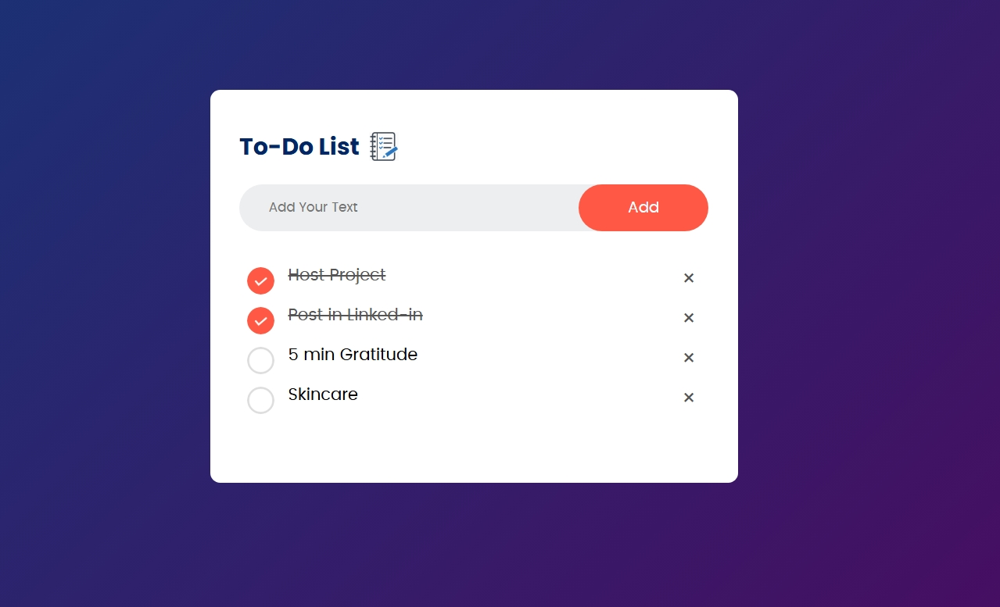

# 📝 To-Do List Web Application

A professional **To-Do List Web App** built with **HTML, CSS, and JavaScript**.  
Manage your daily tasks efficiently with features like **adding, deleting, marking completed tasks**, and **data persistence using Local Storage**. 🚀

---

## ✨ Features
- ➕ Add new tasks easily
- ❌ Delete tasks with a click
- ✅ Mark tasks as completed
- 🔄 Data persistence with Local Storage
- 🎨 Clean, responsive, and user-friendly UI

---

## 🖼️ Screenshot



---

## 🛠️ Tech Stack
- **HTML5** – Structure  
- **CSS3** – Styling & Responsive Design  
- **JavaScript (Vanilla JS)** – Functionality & Local Storage  

---

## 🚀 Live Site
Check out the live version of this project:  
[Live Demo](https://dharshini-cd.github.io/to-do-list/)

---

## 💻 Setup Instructions
1. Clone the repository:  
   ```bash
   git clone https://github.com/dharshini-cd/to-do-list.git
